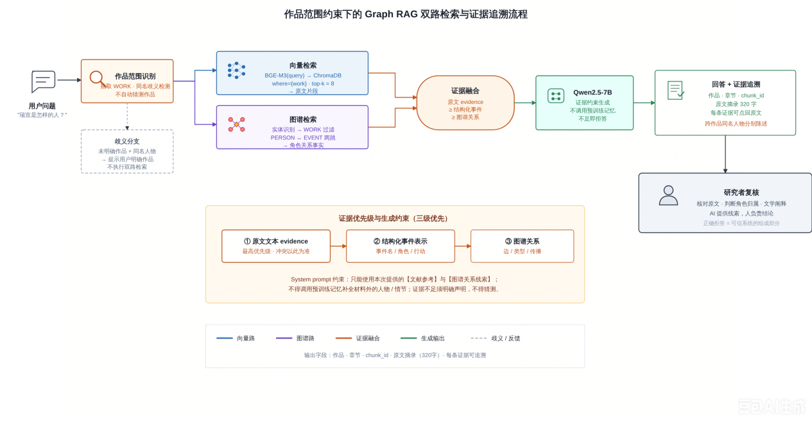
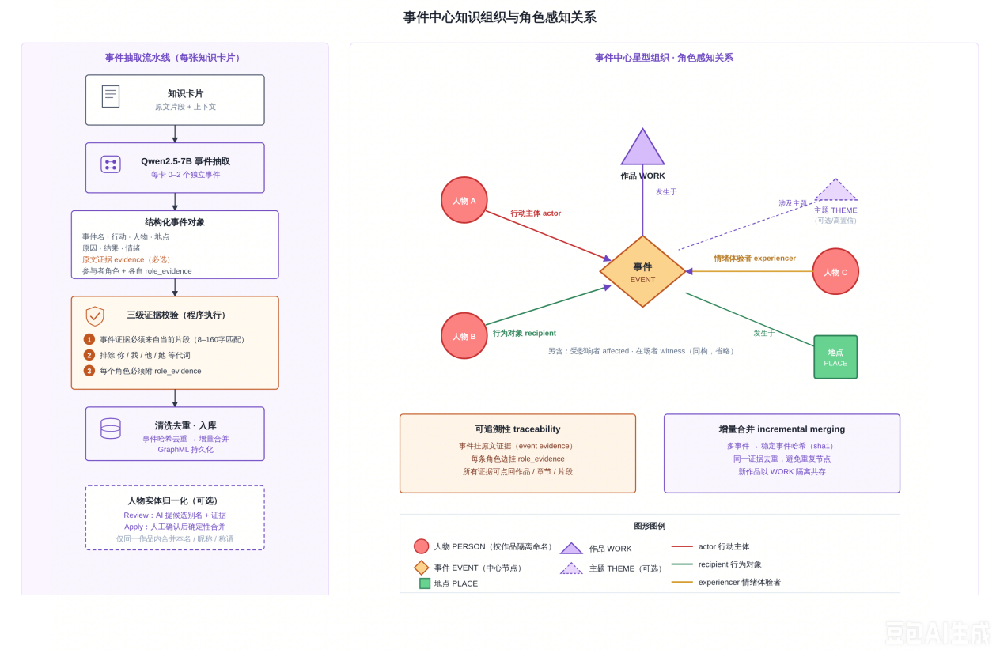

# 完整源代码

下列文本文件全部完整列出，没有省略。两张 PNG 是二进制原图，随压缩包附带，保持 assets 目录结构。

## index.html

```html
<!DOCTYPE html><html lang="en" data-language="en"><head><meta charset="UTF-8"><meta name="viewport" content="width=device-width, initial-scale=1"><meta name="description" content="Jingjing Yang’s academic portfolio: modern Chinese literature, digital humanities, Graph RAG research, and Her Youth, a playable interactive narrative."><meta name="color-scheme" content="light"><title>Jingjing Yang | Literature &amp; Digital Humanities</title><link rel="icon" type="image/svg+xml" href="assets/favicon.svg"><link rel="stylesheet" href="style.css"></head><body><a class="skip" href="#main">跳至正文 / Skip to content</a><header><a class="brand" href="#home"><span class="monogram">JY</span><span><span lang="zh-CN">杨晶晶</span><span lang="en">Jingjing Yang</span></span></a><nav aria-label="Main navigation"><a href="#research"><span lang="zh-CN">研究</span><span lang="en">Research</span></a><a href="#works"><span lang="zh-CN">作品</span><span lang="en">Works</span></a><a href="#records"><span lang="zh-CN">学术档案</span><span lang="en">Academic record</span></a></nav><button id="language" aria-label="切换为中文">中文 <span aria-hidden="true">↗</span></button></header><main id="main"><section class="hero" id="home"><div class="hero-left"><p class="eyebrow">LITERATURE × DIGITAL HUMANITIES</p><h1><span lang="zh-CN">从文学文本，<br>走向新的<br><em>阅读可能。</em></span><span lang="en">Literary texts.<br>New ways<br><em>of reading.</em></span></h1><p class="intro"><span lang="zh-CN">我是杨晶晶，一名探索文学与人工智能交叉领域的硕士研究生。关注中国现当代文学、可复核的文学问答，以及数字媒介中的叙事实践。</span><span lang="en">I’m Jingjing Yang, a master’s student exploring the intersection of literature and artificial intelligence. My interests span modern Chinese literature, verifiable literary question answering, and digital narrative.</span></p><a class="button primary" href="#research"><span lang="zh-CN">浏览研究成果</span><span lang="en">Explore my research</span> <span>↗</span></a></div><aside class="profile"><p class="eyebrow">ACADEMIC PORTFOLIO</p><div class="profile-name"><span lang="zh-CN">杨晶晶</span><span lang="en">Jingjing Yang</span></div><p class="roman">JINGJING YANG</p><div class="profile-rule"></div><p><span lang="zh-CN">硕士研究生 · 中国现当代文学</span><span lang="en">Master’s student · Modern Chinese literature</span></p><p class="muted"><span lang="zh-CN">重庆三峡科技大学<br>重庆人工智能学院 · 联合培养</span><span lang="en">Chongqing Sanxia University Of Science And Technology<br>Joint training at Chongqing Artificial Intelligence Institute</span></p><p class="profile-email"><a href="mailto:2417591879@qq.com">2417591879@qq.com ↗</a></p><div class="profile-tags"><span class="tag"><span lang="zh-CN">数字人文</span><span lang="en">Digital humanities</span></span><span class="tag"><span lang="zh-CN">自然语言处理</span><span lang="en">Natural language processing</span></span><span class="tag"><span lang="zh-CN">人机协同阅读</span><span lang="en">Human–AI reading</span></span></div><div class="profile-bottom"><span>RESEARCH FOCUS</span><b><span lang="zh-CN">以文本证据为起点</span><span lang="en">Grounded in textual evidence</span></b></div></aside></section><div class="index-bar"><span><span lang="zh-CN">研究与实践索引</span><span lang="en">Research & practice index</span></span><a href="#research">01 <span lang="zh-CN">论文与方法</span><span lang="en">Paper & methods</span></a><a href="#system">02 <span lang="zh-CN">系统结果</span><span lang="en">System results</span></a><a href="#works">03 <span lang="zh-CN">数字作品</span><span lang="en">Digital works</span></a><a href="#records">04 <span lang="zh-CN">课程与语言</span><span lang="en">Courses & language</span></a></div><section id="research" class="section"><div class="section-head"><div><p class="eyebrow">01 / RESEARCH</p><h2><span lang="zh-CN">研究，始于一个问题。</span><span lang="en">Research begins with a question.</span></h2></div><p class="section-note"><span lang="zh-CN">如何让计算方法支持文学细读？</span><span lang="en">How can computational methods support close reading?</span></p></div><article class="paper-card"><div class="paper-number">01<span>WORKING PAPER</span></div><div class="paper-main"><div class="meta"><span class="tag"><span lang="zh-CN">修改中 · 准备投稿</span><span lang="en">In revision · Preparing for submission</span></span><span>2026 · Graph RAG</span></div><h3><span lang="zh-CN">面向可复核文学问答的<br>Graph RAG 方法探索</span><span lang="en">Exploring Graph RAG for<br>Verifiable Literary Question Answering</span></h3><p class="paper-subtitle"><span lang="zh-CN">——以《子夜》《四世同堂》部分章节为例</span><span lang="en">A case study of selected chapters from Midnight and Four Generations Under One Roof</span></p><p><span lang="zh-CN">将文学事件知识图谱与向量检索结合，考察证据组织、生成判断与人工复核之间的关系。在人物关系、人物形象和证据边界三类问答中，探索可回到原文检查的研究辅助路径。</span><span lang="en">Combining event-centered knowledge graphs with vector retrieval, this study examines evidence organization, generated judgments, and human review through questions about character relationships, characterization, and evidence boundaries.</span></p><div class="paper-actions"><button class="button dark" data-open="abstract"><span lang="zh-CN">阅读摘要</span><span lang="en">Read abstract</span> ↗</button></div><p class="caption"><span lang="zh-CN">论文正在修改，准备投稿。当前展示摘要、研究图表与案例，暂不提供全文。</span><span lang="en">The manuscript is being revised for submission. Abstract, research figures, and cases are presented; full text is not available.</span></p></div></article></section><section id="system" class="section"><div class="section-head"><div><p class="eyebrow">02 / COMPUTATIONAL RESEARCH</p><h2><span lang="zh-CN">让研究过程，可见、可追溯。</span><span lang="en">Make the research process visible.</span></h2></div><span class="outlined"><span lang="zh-CN">论文记录 · 非实时运行</span><span lang="en">Reported results · Not a live runtime</span></span></div><div class="system-layout"><div class="system-info"><h3><span lang="zh-CN">文学知识图谱<br>与证据问答系统</span><span lang="en">Literary knowledge graph<br>& evidence-based QA</span></h3><p><span lang="zh-CN">从作品与章节出发，组织人物、事件和地点。在生成答案的同时保留检索线索，由研究者判断证据能够支持到何种程度。</span><span lang="en">Organize characters, events, and places within works and chapters, retaining retrieval traces so researchers can assess what the evidence supports.</span></p><div class="stack"><span>BGE-M3</span><span>ChromaDB</span><span>Qwen2.5-7B</span><span>Pyvis</span></div><button class="text-link" data-open="architecture"><span lang="zh-CN">查看系统设计图</span><span lang="en">View system architecture</span> ↗</button><p class="caption"><span lang="zh-CN">已补充第九版笔记本中保存的运行记录；当前展示既有输出，未在线重新运行模型。</span><span lang="en">Saved outputs from the ninth-version notebook are included below. These are recorded results, not a live model run.</span></p></div><div class="results"><div class="result-title"><span>EXPERIMENT / CORPUS</span><span><span lang="zh-CN">部分章节实验</span><span lang="en">Selected chapters</span></span></div><div class="table-wrap"><table><caption class="sr-only"><span lang="zh-CN">实验语料与抽取结果</span><span lang="en">Experimental corpus and extraction results</span></caption><thead><tr><th><span lang="zh-CN">实验材料</span><span lang="en">Corpus</span></th><th><span lang="zh-CN">文本规模¹</span><span lang="en">Characters¹</span></th><th><span lang="zh-CN">知识卡片</span><span lang="en">Cards</span></th><th><span lang="zh-CN">事件</span><span lang="en">Events</span></th></tr></thead><tbody><tr><th><span lang="zh-CN">《子夜》<small>前四章</small></span><span lang="en">Midnight<small>Chapters 1–4</small></span></th><td>59,725</td><td>38</td><td>14</td></tr><tr><th><span lang="zh-CN">《四世同堂》<small>前十三章</small></span><span lang="en">Four Generations<small>Chapters 1–13</small></span></th><td>63,298</td><td>39</td><td>9</td></tr></tbody></table></div><p class="caption"><span lang="zh-CN">¹ 去除空白符后的正文字符数。事件数量差异不直接代表叙事特征差异。</span><span lang="en">¹ Body characters excluding whitespace. Event counts alone do not establish differences in narrative characteristics.</span></p></div></div><div class="notebook-results"><p class="eyebrow">NOTEBOOK / RECORDED OUTPUT</p><h3><span lang="zh-CN">第九版 · 运行结果摘录</span><span lang="en">Version 9 · Recorded outputs</span></h3><p class="muted"><span lang="zh-CN">来源：第九版—作品命名空间与实体消歧。以下数字来自笔记本中保存的输出，不代表重新运行或独立复现实验。</span><span lang="en">Source: the version 9 notebook on work namespaces and entity disambiguation. Figures are taken from its saved outputs, not from a new run or independent replication.</span></p><div class="run-metrics"><div><strong>55</strong><span><span lang="zh-CN">图谱节点</span><span lang="en">Graph nodes</span></span></div><div><strong>65</strong><span><span lang="zh-CN">图谱关系边</span><span lang="en">Graph edges</span></span></div><div><strong>8</strong><span><span lang="zh-CN">问答检索片段</span><span lang="en">Retrieved passages</span></span></div><div><strong>3</strong><span><span lang="zh-CN">问答图谱线索</span><span lang="en">Graph clues</span></span></div></div><p><span lang="zh-CN">问答案例：“瑞宣是一个怎样的人？”检索返回 8 条文本片段与 3 条图谱关系线索，并输出原文依据供人工复核。</span><span lang="en">Example question: “What kind of person is Ruixuan?” Retrieval returned 8 passages and 3 graph clues, with source excerpts for human review.</span></p><p class="caption"><span lang="zh-CN">实体消歧记录采用 REVIEW 模式，输出候选但未修改图谱。候选中存在需要纠正的匹配，不能将模型的 HIGH 标签视为已确认的实体身份。</span><span lang="en">Entity disambiguation ran in REVIEW mode and did not modify the graph. Some candidate matches need correction; a model-assigned HIGH label is not confirmation of identity.</span></p></div><div class="case-list"><p class="eyebrow"><span lang="zh-CN">问答案例 · 点击展开复核结论</span><span lang="en">QA CASES · EXPAND TO READ THE REVIEW</span></p><details class="case"><summary><span class="case-type">01 / <span lang="zh-CN">人物关系</span><span lang="en">Character relationships</span></span><span class="case-question"><span lang="zh-CN">大赤包和桐芳关系怎么样？</span><span lang="en">What is the relationship between Dachibao and Tongfang?</span></span><span class="plus" aria-hidden="true">+</span></summary><div class="case-answer"><b><span lang="zh-CN">人工复核与研究启示</span><span lang="en">Human review & research implications</span></b><p><span lang="zh-CN">能够定位相关文本，但生成回答将原文中的偏听偏信概括为合作关系，出现人物关系与结论错位。这一案例说明：证据可追溯，不等于解释自动成立。</span><span lang="en">Relevant passages were retrieved, but the generated answer overstated a cooperative relationship. Traceable evidence does not automatically validate an interpretation.</span></p></div></details><details class="case"><summary><span class="case-type">02 / <span lang="zh-CN">人物形象</span><span lang="en">Characterization</span></span><span class="case-question"><span lang="zh-CN">瑞宣是一个怎样的人？</span><span lang="en">What kind of person is Ruixuan?</span></span><span class="plus" aria-hidden="true">+</span></summary><div class="case-answer"><b><span lang="zh-CN">人工复核与研究启示</span><span lang="en">Human review & research implications</span></b><p><span lang="zh-CN">论文记录向量检索返回 8 条片段，图谱检索返回 3 条关系线索。回答为责任感、家庭顾虑与内心矛盾提供细读线索；更高层次的解释仍需结合原文人工复核。</span><span lang="en">The manuscript reports 8 retrieved passages and 3 graph relationship clues. They support further close reading of responsibility, family concerns, and inner conflict; broader interpretations still require human review.</span></p></div></details><details class="case"><summary><span class="case-type">03 / <span lang="zh-CN">证据边界</span><span lang="en">Evidence boundaries</span></span><span class="case-question"><span lang="zh-CN">吴荪甫最终结局如何？</span><span lang="en">What ultimately happens to Wu Sunfu?</span></span><span class="plus" aria-hidden="true">+</span></summary><div class="case-answer"><b><span lang="zh-CN">人工复核与研究启示</span><span lang="en">Human review & research implications</span></b><p><span lang="zh-CN">当前语料仅含《子夜》前四章。系统说明材料不足，没有强行补全结局，展示了对实验文本范围的约束。</span><span lang="en">With only the first four chapters of Midnight in the corpus, the system acknowledged insufficient evidence rather than inventing a conclusion.</span></p></div></details></div></section><section id="works" class="section"><div class="section-head"><div><p class="eyebrow">03 / PROJECTS & DIGITAL WORKS</p><h2><span lang="zh-CN">在文本之外，继续探索。</span><span lang="en">Explore beyond the written page.</span></h2></div></div><div class="works-grid"><article class="game"><div class="game-top"><span>INTERACTIVE FICTION</span><span>01</span></div><h3><span lang="zh-CN">她的<br><em>青春</em></span><span lang="en">Her<br><em>Youth</em></span></h3><div class="game-bottom"><p><span lang="zh-CN">个人制作的文字游戏</span><span lang="en">An original text-based game</span></p><span class="tag"><span lang="zh-CN">在线试玩已上线</span><span lang="en">Play in your browser</span></span></div></article><div class="work-description"><p class="eyebrow"><span lang="zh-CN">文字游戏 / 原创作品</span><span lang="en">TEXT-BASED GAME / ORIGINAL WORK</span></p><h3><span lang="zh-CN">《她的青春》</span><span lang="en">Her Youth</span></h3><p><span lang="zh-CN">以大学女生青春为主题的互动叙事游戏。通过剧情分支、角色属性、存档与校园自由探索，将文字叙事转化为可参与的数字体验。</span><span lang="en">An interactive narrative game about a young woman’s university years. Branching storylines, character attributes, saved progress, and free exploration of campus turn a written narrative into a participatory digital experience.</span></p><div class="project-actions"><a class="button primary" href="https://y003922.github.io/her-youth-game/" target="_blank" rel="noopener noreferrer"><span lang="zh-CN">在线试玩</span><span lang="en">Play online</span> ↗</a><a class="text-link" href="https://github.com/Y003922/her-youth-game" target="_blank" rel="noopener noreferrer"><span lang="zh-CN">查看源代码</span><span lang="en">View source on GitHub</span> ↗</a></div><div class="stack" aria-label="Technology stack"><span>React</span><span>TypeScript</span><span>Zustand</span><span>GitHub Pages</span></div><div class="narrative-note"><h4><span lang="zh-CN">互动叙事实践</span><span lang="en">Interactive narrative practice</span></h4><p><span lang="zh-CN">这个项目将叙事写作与前端开发结合：剧情分支组织故事路径，角色属性维护人物状态，存档支持持续体验。它为我进一步思考读者选择与数字叙事结构提供了创作实践。</span><span lang="en">The project brings narrative writing together with front-end development: branching storylines organize story paths, character attributes track state, and saved progress supports continued play. It provides a creative foundation for exploring reader choice and the structure of digital narratives.</span></p></div><div class="related"><p class="eyebrow"><span lang="zh-CN">另一项项目经历</span><span lang="en">ANOTHER PROJECT</span></p><h4><span lang="zh-CN">基于 Qwen2-7B 的何其芳文学风格建模与可控文本生成研究</span><span lang="en">Modeling He Qifang’s Literary Style and Controllable Text Generation with Qwen2-7B</span></h4><span class="tag"><span lang="zh-CN">校级研究生科研创新项目 · 项目负责人</span><span lang="en">University-level postgraduate research innovation project · Project Lead</span></span><p><span lang="zh-CN">围绕何其芳诗歌与散文语料开展训练探索，关注文学风格与生成式文本之间的关系。实验记录、方法细节与生成样例待补充。</span><span lang="en">Training explorations using He Qifang’s poetry and prose, examining literary style in generated text. Experiment records, method details, and samples are to be added.</span></p><span class="caption"><span lang="zh-CN">依据个人项目说明整理</span><span lang="en">Based on the researcher’s project description</span></span></div></div></div></section><div class="additional-research"><article><p class="eyebrow">POSTGRADUATE RESEARCH</p><span class="tag"><span lang="zh-CN">市级研究生科研创新项目 · 项目参与者</span><span lang="en">Municipal-level postgraduate research innovation project · Participant</span></span><h3><span lang="zh-CN">面向特殊儿童艺术疗愈的沉浸式AR绘本开发与教学应用研究</span><span lang="en">Immersive AR Picture Books for Art-Based Therapeutic Support for Children with Special Needs: Development and Educational Applications</span></h3><p><span lang="zh-CN">重庆三峡科技大学研究生科研创新项目。参与围绕沉浸式增强现实绘本开发及教学应用开展的研究，关注艺术疗愈与特殊儿童支持。</span><span lang="en">A postgraduate research innovation project at Chongqing Sanxia University Of Science And Technology. Participating in research on immersive augmented-reality picture books and their educational applications, with a focus on art-based therapeutic support for children with special needs.</span></p></article><article><p class="eyebrow">POSTGRADUATE COMPETITION</p><h3><span lang="zh-CN">全国通用人工智能挑战赛</span><span lang="en">National Artificial General Intelligence Challenge</span></h3><div class="competition-rank"><strong>193 <span>/ 701</span></strong><p><span lang="zh-CN">高校组队伍排名</span><span lang="en">Team ranking · University division</span></p></div><p><span lang="zh-CN">组织队伍参加比赛，在高校组共 701 支赛队中排名第 193。</span><span lang="en">Organized a team to compete in the university division, ranking 193rd out of 701 teams.</span></p></article></div><section id="records" class="section"><div class="section-head"><div><p class="eyebrow">04 / ACADEMIC RECORD</p><h2><span lang="zh-CN">学习背景与能力积累。</span><span lang="en">Academic preparation.</span></h2></div><p class="section-note"><span lang="zh-CN">研一课程成绩 · 英语能力</span><span lang="en">Year 1 coursework · English proficiency</span></p></div><div class="education-entry"><p class="eyebrow">UNDERGRADUATE EDUCATION</p><div class="education-heading"><h3><span lang="zh-CN">汉语言文学（师范）</span><span lang="en">Chinese Language and Literature (Teacher Education)</span></h3><span>Sep 2021 – Jul 2025</span></div><p><span lang="zh-CN">重庆三峡学院（现重庆三峡科技大学）</span><span lang="en">Chongqing Sanxia University Of Science And Technology</span></p><p class="caption"><span lang="zh-CN">学校于2026年更名；本科阶段校名按就读时名称列示。</span><span lang="en">The university’s Chinese name changed in 2026; the undergraduate record retains its name at the time of study: 重庆三峡学院.</span></p></div><div class="undergraduate-honors"><p class="eyebrow">UNDERGRADUATE COMPETITIONS &amp; HONORS</p><h3><span lang="zh-CN">本科竞赛与荣誉</span><span lang="en">Undergraduate competitions &amp; honors</span></h3><ul><li><strong><span lang="zh-CN">“外研社·国才杯”英语组校区演讲二等奖</span><span lang="en">FLTRP · ETIC Cup — English Speech, Campus Round, Second Prize</span></strong><span class="honor-date"><span lang="zh-CN">2023–2024 · 上学期</span><span lang="en">2023–2024 · Semester 1</span></span></li><li><strong><span lang="zh-CN">校级一等奖学金</span><span lang="en">University First-Class Scholarship</span></strong><span class="honor-date"><span lang="zh-CN">2024–2025 · 上学期</span><span lang="en">2024–2025 · Semester 1</span></span></li><li><strong><span lang="zh-CN">校级二等奖学金（两次）</span><span lang="en">University Second-Class Scholarship (twice)</span></strong><span class="honor-date"><span lang="zh-CN">2023–2024 · 两学期</span><span lang="en">2023–2024 · Both semesters</span></span></li><li><strong><span lang="zh-CN">校级“三好学生”</span><span lang="en">University Merit Student</span></strong><span class="honor-date"><span lang="zh-CN">2024–2025 · 上学期</span><span lang="en">2024–2025 · Semester 1</span></span></li><li><strong><span lang="zh-CN">文学院优秀大学毕业生</span><span lang="en">Outstanding Graduate, School of Literature</span></strong><span class="honor-date"><span lang="zh-CN">2025</span><span lang="en">2025</span></span></li></ul></div><div class="records-grid"><article><div class="record-head"><h3><span lang="zh-CN">研一课程成绩</span><span lang="en">Year 1 coursework</span></h3><span class="tag"><span lang="zh-CN">已录入 12 门课程</span><span lang="en">12 courses recorded</span></span></div><p class="muted"><span lang="zh-CN">依据两学期成绩截图整理，展示课程学分与最终成绩。</span><span lang="en">Course credits and final scores transcribed from the two semester records.</span></p><div class="semester"><h4><span lang="zh-CN">第一学期 · 文学基础</span><span lang="en">Semester 1 · Literary studies</span></h4><div class="table-wrap"><table class="grade-table"><caption class="sr-only"><span lang="zh-CN">第一学期 · 文学基础</span><span lang="en">Semester 1 · Literary studies</span></caption><thead><tr><th><span lang="zh-CN">课程</span><span lang="en">Course</span></th><th><span lang="zh-CN">学分</span><span lang="en">Credits</span></th><th><span lang="zh-CN">成绩 / 100</span><span lang="en">Score / 100</span></th></tr></thead><tbody><tr><th><span lang="zh-CN">新时代中国特色社会主义理论与实践</span><span lang="en">Theory and Practice of Socialism with Chinese Characteristics for a New Era</span></th><td>2</td><td><strong>94</strong></td></tr><tr><th><span lang="zh-CN">研究生英语</span><span lang="en">Graduate English</span></th><td>2</td><td><strong>89</strong></td></tr><tr><th><span lang="zh-CN">中国文化史</span><span lang="en">History of Chinese Culture</span></th><td>2</td><td><strong>65</strong></td></tr><tr><th><span lang="zh-CN">语言文字研究方法</span><span lang="en">Research Methods in Language and Writing</span></th><td>2</td><td><strong>88</strong></td></tr><tr><th><span lang="zh-CN">学术规范与学术伦理</span><span lang="en">Academic Standards and Research Ethics</span></th><td>1</td><td><strong>87</strong></td></tr><tr><th><span lang="zh-CN">中国现代文学史料学</span><span lang="en">Historical Sources for Modern Chinese Literature</span></th><td>2</td><td><strong>92</strong></td></tr></tbody></table></div></div><div class="semester"><h4><span lang="zh-CN">第二学期 · 重庆人工智能学院</span><span lang="en">Semester 2 · Chongqing Artificial Intelligence Institute</span></h4><div class="table-wrap"><table class="grade-table"><caption class="sr-only"><span lang="zh-CN">第二学期 · 重庆人工智能学院</span><span lang="en">Semester 2 · Chongqing Artificial Intelligence Institute</span></caption><thead><tr><th><span lang="zh-CN">课程</span><span lang="en">Course</span></th><th><span lang="zh-CN">学分</span><span lang="en">Credits</span></th><th><span lang="zh-CN">成绩 / 100</span><span lang="en">Score / 100</span></th></tr></thead><tbody><tr><th><span lang="zh-CN">人工智能与社会科学</span><span lang="en">Artificial Intelligence and Social Sciences</span></th><td>2</td><td><strong>96</strong></td></tr><tr><th><span lang="zh-CN">生成式软件开发</span><span lang="en">Generative Software Development</span></th><td>3</td><td><strong>90</strong></td></tr><tr><th><span lang="zh-CN">Python大数据分析与应用</span><span lang="en">Python for Big Data Analysis and Applications</span></th><td>2</td><td><strong>86</strong></td></tr><tr><th><span lang="zh-CN">深度与强化学习</span><span lang="en">Deep Learning and Reinforcement Learning</span></th><td>3</td><td><strong>93</strong></td></tr><tr><th><span lang="zh-CN">自然语言处理</span><span lang="en">Natural Language Processing</span></th><td>3</td><td><strong>96</strong></td></tr><tr><th><span lang="zh-CN">自然语言处理综合实践</span><span lang="en">Integrated Practice in Natural Language Processing</span></th><td>3</td><td><strong>83</strong></td></tr></tbody></table></div></div><div class="missing"><span lang="zh-CN">研二还有两门课程，课程名称与成绩待补充。以上为研一阶段成绩，并非完整研究生成绩单。</span><span lang="en">Two courses remain in Year 2; titles and grades are to be added. This is a Year 1 record, not the complete graduate transcript.</span></div></article><article class="language-card"><p class="eyebrow">LANGUAGE PROFICIENCY</p><h3>IELTS Academic</h3><div class="score">5.5<span><span lang="zh-CN">总分 / 9</span><span lang="en">Overall / 9</span></span></div><p><span lang="zh-CN">考试日期：2026 年 9 月 12 日</span><span lang="en">Test date: 12 September 2026</span></p><ul class="ielts-components"><li><span><span lang="zh-CN">听力</span><span lang="en">Listening</span></span><strong>5.5</strong></li><li><span><span lang="zh-CN">阅读</span><span lang="en">Reading</span></span><strong>6.0</strong></li><li><span><span lang="zh-CN">写作</span><span lang="en">Writing</span></span><strong>5.5</strong></li><li><span><span lang="zh-CN">口语</span><span lang="en">Speaking</span></span><strong>5.5</strong></li></ul><p class="caption"><span lang="zh-CN">根据所提供的雅思学术类成绩报告录入。</span><span lang="en">Transcribed from the supplied IELTS Academic Test Report Form.</span></p><div class="language-footer"><span lang="zh-CN">研究生英语课程：89 / 100<br>课程成绩与雅思成绩分开呈现。</span><span lang="en">Graduate English course: 89 / 100<br>Course and IELTS scores are reported separately.</span></div></article></div></section></main><footer><div class="brand"><span class="monogram">JY</span><span lang="zh-CN">杨晶晶 · 学术作品集</span><span lang="en">Jingjing Yang · Academic portfolio</span></div><p>Literature. Evidence. Interpretation.</p><a href="#home"><span lang="zh-CN">回到顶部</span><span lang="en">Back to top</span> ↑</a></footer><dialog id="abstract"><div class="dialog-head"><span><span lang="zh-CN">论文摘要</span><span lang="en">Research abstract</span></span><button data-close aria-label="Close / 关闭">×</button></div><div class="dialog-body"><p class="eyebrow">GRAPH RAG / WORKING PAPER</p><h2><span lang="zh-CN">面向可复核文学问答的 Graph RAG 方法探索</span><span lang="en">Exploring Graph RAG for Verifiable Literary Question Answering</span></h2><p><span lang="zh-CN">以《子夜》前四章与《四世同堂》前十三章为实验材料，探讨文学问答中证据组织、生成判断与人工复核之间的关系。构建以文学事件为中心的 Graph RAG 问答系统，结合向量检索与图谱检索，实现语义检索、事件抽取、关系可视化与生成式问答；针对人物角色混淆、群像叙事事件遗漏及多作品同名污染，引入角色感知关系、原文证据约束、作品范围标识及人物实体归一化机制，并通过人物关系梳理、人物形象辅助解释和证据边界三类问答开展案例分析。结果显示，事件知识图谱与检索增强生成可为文学阅读提供证据组织和线索发现的辅助路径，其解释结果仍须结合原文语境进行人工复核。</span><span lang="en">Using the first four chapters of Midnight and the first thirteen chapters of Four Generations Under One Roof, this study examines evidence organization, generated judgments, and human review in literary question answering. An event-centered Graph RAG system combines vector and graph retrieval for semantic search, event extraction, visualization, and generative QA. Role-aware relations, source-evidence constraints, work-scoped identifiers, and entity normalization address role confusion, omitted events, and cross-work entity contamination. Cases on character relationships, characterization, and evidence boundaries suggest that this approach can help organize evidence and identify reading clues. Interpretations still require human verification within the original textual context.</span></p></div></dialog><dialog id="architecture" class="wide-dialog"><div class="dialog-head"><span><span lang="zh-CN">系统设计图 · 来自论文稿</span><span lang="en">System design · From the manuscript</span></span><button data-close aria-label="Close / 关闭">×</button></div><div class="dialog-body"><figure><figcaption><span lang="zh-CN">双路检索与证据追溯流程</span><span lang="en">Dual retrieval and evidence tracing</span></figcaption></figure><figure><figcaption><span lang="zh-CN">事件中心知识组织与角色感知关系（设计示意，非实时图谱）</span><span lang="en">Event-centered organization and role-aware relations (design diagram, not a live graph)</span></figcaption></figure></div></dialog><script src="app.js"></script></body></html>
```

## style.css

```css
:root{--ink:#1b343b;--muted:#607278;--line:#d9e1e3;--paper:#f8fafb;--lime:#cbea73;--blue:#e9f0f5;--serif:Georgia,'Songti SC','SimSun',serif;--sans:Inter,'PingFang SC','Microsoft YaHei',Arial,sans-serif}*{box-sizing:border-box}html{scroll-behavior:smooth;scroll-padding-top:100px}body{margin:0;background:var(--paper);color:var(--ink);font-family:var(--sans);font-size:16px;line-height:1.75}html[data-language=zh] [lang=en],html[data-language=en] [lang=zh-CN]{display:none}a{color:inherit;text-decoration:none}button{font:inherit;cursor:pointer;color:inherit}a,button,summary{-webkit-tap-highlight-color:transparent}button:focus-visible,a:focus-visible,summary:focus-visible{outline:3px solid #758b2f;outline-offset:5px}header{height:92px;max-width:1440px;margin:auto;padding:0 6%;display:flex;align-items:center;gap:40px;border-bottom:1px solid var(--line)}.brand{display:flex;align-items:center;gap:13px;font-weight:650;letter-spacing:.04em}.monogram{width:36px;height:39px;display:inline-flex;align-items:center;justify-content:center;background:var(--ink);color:var(--lime);font-family:var(--serif);font-size:19px;letter-spacing:-1px}nav{margin-left:auto;display:flex;gap:35px;font-size:14px}nav a:hover,.text-link:hover{color:#527008}#language{border:1px solid var(--line);border-radius:30px;padding:6px 17px;background:transparent;font-size:14px;white-space:nowrap}main{max-width:1440px;margin:auto;padding:0 6%}.hero{display:grid;grid-template-columns:1.4fr 1fr;gap:9%;padding:80px 0 68px;align-items:center}.eyebrow{font-size:12px;letter-spacing:.16em;font-weight:650;margin:0 0 25px}.hero h1{font-size:clamp(42px,4.9vw,72px);line-height:1.32;font-family:var(--serif);font-weight:400;letter-spacing:-.045em;margin:0 0 25px}.hero h1 em{font-style:normal;color:#536d20;position:relative}.intro{max-width:550px;color:var(--muted);margin:0 0 30px;line-height:1.95}.button{border:0;padding:12px 23px;border-radius:4px;font-size:14px;display:inline-flex;align-items:center;gap:24px;line-height:1.5;min-height:46px}.primary{background:var(--lime)}.primary:hover{background:#d8ef9d}.dark{background:var(--ink);color:#fff}.dark:hover{background:#314f57}.profile{background:var(--blue);padding:42px 35px 0;border-top:3px solid var(--ink);align-self:stretch;display:flex;flex-direction:column;justify-content:center;min-height:430px}.profile .eyebrow{font-size:12px}.profile-name{font-family:var(--serif);font-size:42px;line-height:1.3}.roman{font-size:13px;letter-spacing:.2em;margin:10px 0 24px}.profile-rule{height:1px;background:#b7c8d0;margin-bottom:18px}.profile p:not(.eyebrow):not(.roman){font-size:14px;line-height:1.8;margin:7px 0}.muted{color:var(--muted)}.profile-tags{display:flex;flex-wrap:wrap;gap:7px;margin:23px 0 30px}.tag{display:inline-flex;font-size:12px;padding:3px 10px;background:#edf2e2;border:1px solid #dce7c3;border-radius:3px;line-height:1.6;color:#425c27}.profile .tag{background:transparent;border-color:#bdcbd2;color:var(--ink)}.profile-bottom{border-top:1px solid #b7c8d0;display:flex;justify-content:space-between;align-items:center;gap:15px;font-size:12px;padding:19px 0;margin-top:auto}.profile-bottom b{font-size:14px;font-weight:500}.index-bar{border-top:1px solid var(--line);border-bottom:1px solid var(--line);padding:22px 0;display:flex;align-items:center;justify-content:space-between;gap:15px;font-size:14px}.index-bar>span{color:var(--muted);font-size:12px}.index-bar a:hover{text-decoration:underline;text-underline-offset:5px}.section{padding:76px 0 0}.section-head{display:flex;justify-content:space-between;align-items:end;gap:24px;margin-bottom:32px}.section-head .eyebrow{margin-bottom:12px;color:var(--muted)}h2{font-family:var(--serif);font-weight:400;font-size:32px;line-height:1.45;margin:0;letter-spacing:-.025em}.section-note{font-size:14px;color:var(--muted);margin:0 0 4px}.paper-card{border:1px solid var(--line);background:#fff;display:grid;grid-template-columns:155px 1fr;position:relative}.paper-number{border-right:1px solid var(--line);padding:34px 26px;font:56px var(--serif);color:#72858c;display:flex;flex-direction:column;justify-content:space-between;gap:20px}.paper-number>span{font:11px var(--sans);letter-spacing:.13em;writing-mode:vertical-rl;transform:rotate(180deg);align-self:start}.paper-main{padding:35px 42px}.meta{display:flex;align-items:center;gap:15px;font-size:12px;color:var(--muted)}h3{font-family:var(--serif);font-weight:400;line-height:1.5;font-size:28px;margin:20px 0 12px}.paper-subtitle{font-size:16px;color:var(--muted);margin-top:0}.paper-main>p:not(.paper-subtitle):not(.caption){max-width:790px;color:var(--muted)}.paper-actions{display:flex;align-items:center;gap:25px;flex-wrap:wrap;margin-top:27px}.text-link{border:0;background:transparent;padding:8px 0;font-size:14px;text-decoration:underline;text-underline-offset:5px}.caption{font-size:12px;line-height:1.8;color:var(--muted)}.paper-main .caption{margin:16px 0 0}.outlined{font-size:12px;border:1px solid var(--line);padding:4px 11px;white-space:normal}.system-layout{display:grid;grid-template-columns:1fr 1.45fr;gap:55px;align-items:start}.system-info h3{margin:0 0 15px;font-size:27px}.system-info>p{color:var(--muted);margin-top:0}.stack{display:flex;flex-wrap:wrap;gap:7px;margin:20px 0 12px}.stack span{font-family:monospace;font-size:12px;border:1px solid var(--line);padding:2px 8px;border-radius:3px}.results{background:#fff;border:1px solid var(--line)}.result-title{padding:20px 22px;background:var(--ink);color:#fff;display:flex;justify-content:space-between;gap:15px;font-size:12px;letter-spacing:.05em}.table-wrap{overflow-x:auto}table{width:100%;border-collapse:collapse;text-align:left;white-space:normal;font-size:14px}th,td{padding:19px 16px;border-bottom:1px solid var(--line);font-weight:400}thead th{font-size:12px;color:var(--muted);background:#f5f8f9}tbody th{font-weight:550;width:39%}small{display:block;font-size:12px;color:var(--muted);font-weight:400}td{font-variant-numeric:tabular-nums}.results .caption{padding:0 20px}.case-list{margin-top:32px}.case-list>.eyebrow{margin-bottom:15px;color:var(--muted)}.case{border-top:1px solid var(--line)}.case:last-child{border-bottom:1px solid var(--line)}summary{list-style:none;cursor:pointer;display:grid;grid-template-columns:190px 1fr 24px;align-items:center;gap:15px;padding:23px 0}summary::-webkit-details-marker{display:none}.case-type{font-size:12px;color:var(--muted)}.case-question{font-size:16px}.plus{font-size:24px;font-weight:300}.case[open] .plus{transform:rotate(45deg)}.case-answer{max-width:850px;padding:0 20px 20px 205px;color:var(--muted);font-size:15px}.case-answer b{font-size:12px;color:#527008}.case-answer p{margin:8px 0}.works-grid{display:grid;grid-template-columns:1fr 1.05fr;gap:60px}.game{background:var(--ink);color:#ecf2ee;padding:32px 38px;min-height:480px;display:flex;flex-direction:column}.game-top{display:flex;justify-content:space-between;font-size:12px;letter-spacing:.15em;color:#a9bdc2}.game h3{font-size:80px;line-height:1.3;letter-spacing:.1em;margin:35px 0;font-family:var(--serif);font-weight:400}.game h3 em{color:var(--lime);font-style:normal}.game-bottom{margin-top:auto;padding-top:22px;border-top:1px solid #567078;display:flex;align-items:center;justify-content:space-between;gap:15px;flex-wrap:wrap}.game-bottom p{font-size:14px;margin:0}.game .tag{border-color:#6b8389;background:transparent;color:#cedbdd}.work-description{padding:9px 0}.work-description>.eyebrow{margin-bottom:12px;color:var(--muted)}.work-description h3{margin-top:0;font-size:30px}.work-description p{color:var(--muted)}.missing{padding:13px 16px;border-left:2px solid #b1c27b;background:#edf2e7;font-size:14px;margin:25px 0}.related{border-top:1px solid var(--line);margin-top:26px;padding-top:25px}.related .eyebrow{margin-bottom:12px}.related h4{font-size:18px;font-weight:500;margin:0 0 10px}.related p{font-size:14px;line-height:1.85;margin:0 0 10px}.records-grid{display:grid;grid-template-columns:1.5fr 1fr;gap:45px}.record-head{display:flex;align-items:center;justify-content:space-between;gap:15px}.record-head h3{margin:0}.records-grid article>p{font-size:14px}.courses{list-style:none;margin:25px 0 15px;padding:0}.courses li{display:flex;justify-content:space-between;gap:18px;align-items:center;padding:17px 0;border-bottom:1px solid var(--line);font-size:15px}.pending{font-size:12px;color:var(--muted);white-space:nowrap}.language-card{padding:28px 30px;background:var(--blue);display:flex;flex-direction:column}.language-card>.eyebrow{margin:0;color:var(--muted)}.language-card h3{margin:14px 0 8px}.score{font:64px var(--serif);display:flex;align-items:center;gap:22px;line-height:1.3}.score span{font:14px var(--sans);color:var(--muted)}.language-card>p:not(.eyebrow){color:var(--muted)}.language-footer{margin-top:auto;padding-top:18px;border-top:1px solid #bdcbd2;font-size:12px;color:var(--muted)}footer{margin:85px auto 0;max-width:1440px;border-top:1px solid var(--line);padding:30px 6%;display:flex;align-items:center;justify-content:space-between;gap:25px;font-size:12px;color:var(--muted)}footer .brand{font-size:14px;color:var(--ink)}footer .monogram{width:28px;height:31px;font-size:16px}dialog{border:1px solid var(--line);border-radius:6px;padding:0;width:min(800px,calc(100% - 32px));max-height:88dvh;color:var(--ink);background:#fff;box-shadow:0 30px 90px #0004}dialog::backdrop{background:#102b36aa;backdrop-filter:blur(4px)}.dialog-head{display:flex;justify-content:space-between;align-items:center;gap:20px;padding:17px 28px;border-bottom:1px solid var(--line);position:sticky;top:0;background:#fff;z-index:1;font-size:14px}.dialog-head button{border:0;background:transparent;font-size:28px;width:40px;min-height:40px}.dialog-body{padding:28px 36px 38px}.dialog-body>p{line-height:2}.dialog-body h2{font-size:29px}.wide-dialog{width:min(1100px,calc(100% - 32px))}figure{margin:0 0 28px}figure img{width:100%;height:auto;display:block}figcaption{font-size:13px;color:var(--muted);margin-top:12px}.sr-only,.skip:not(:focus){position:absolute;width:1px;height:1px;padding:0;margin:-1px;overflow:hidden;clip:rect(0,0,0,0);white-space:nowrap;border:0}.skip:focus{display:block;padding:10px;background:var(--lime)}html[data-language=en] .hero h1{letter-spacing:-.05em}html[data-language=en] .profile-name{font-size:34px}html[data-language=en] .game h3{letter-spacing:0;font-size:70px}html[data-language=en] .profile-bottom{flex-wrap:wrap}
@media(min-width:1600px){.hero h1{font-size:72px}}@media(max-width:1000px){header{gap:20px;padding:0 5%}main{padding:0 5%}.hero{gap:6%;padding-top:55px}.profile{padding:28px 24px 0}.hero h1{font-size:49px}.system-layout{gap:28px;grid-template-columns:1fr 1.2fr}.paper-main{padding:28px}.paper-card{grid-template-columns:110px 1fr}.works-grid{gap:35px}.game h3{font-size:70px}.game{padding:28px;min-height:450px}.records-grid{gap:30px}.index-bar>span{display:none}th,td{padding:15px 10px}.section-head{align-items:start}.section-note{max-width:220px}}
@media(max-width:700px){header{height:auto;min-height:80px;padding:18px 5%;gap:16px;flex-wrap:wrap}.brand{font-size:15px}nav{order:3;width:100%;margin:0;border-top:1px solid var(--line);padding-top:12px;justify-content:space-between;gap:18px;font-size:14px}#language{margin-left:auto}.hero{grid-template-columns:1fr;padding:40px 0;gap:35px}.hero h1{font-size:47px;line-height:1.3}.hero h1 br:nth-of-type(2){display:none}.hero .eyebrow{font-size:11px}.intro{font-size:16px}.profile{min-height:0;padding:27px 25px 0}.profile-name{font-size:34px}.profile .eyebrow{margin-bottom:20px}.profile-tags{margin:18px 0 25px}.profile-bottom{flex-wrap:wrap}.index-bar{display:grid;grid-template-columns:1fr 1fr;font-size:13px;gap:14px}.section{padding-top:48px}.section-head{display:block;margin-bottom:24px}h2{font-size:27px}.section-note,.outlined{display:inline-block;margin-top:12px}.paper-card{grid-template-columns:1fr}.paper-number{flex-direction:row;align-items:center;font-size:35px;padding:15px 22px;border-right:0;border-bottom:1px solid var(--line)}.paper-number>span{writing-mode:initial;transform:none;align-self:center}.paper-main{padding:24px 22px}.paper-main h3{font-size:25px}.paper-actions{gap:14px}.meta{flex-wrap:wrap;gap:9px}.system-layout,.works-grid,.records-grid{grid-template-columns:1fr;gap:27px}.system-info h3{font-size:25px}.system-info h3 br{display:none}.result-title{padding:16px;font-size:11px}table{font-size:13px}summary{grid-template-columns:1fr 24px;gap:5px;padding:18px 0}.case-type{grid-column:1}.case-question{grid-column:1;grid-row:2}.plus{grid-column:2;grid-row:1 / span 2}.case-answer{padding:0 16px 20px 0}.game{min-height:410px}.game h3{font-size:68px;line-height:1.25;margin:28px 0}.game-bottom{gap:14px}.works-grid{gap:30px}.records-grid{gap:25px}.courses li{font-size:14px}.record-head{flex-wrap:wrap}.language-card{padding:25px}.language-footer{margin-top:20px}footer{margin-top:48px;flex-wrap:wrap;padding:27px 5%;gap:16px}footer>p{order:3;width:100%;margin:0}footer>a{margin-left:auto}.dialog-body{padding:24px}.dialog-body h2{font-size:25px}.dialog-head{padding:12px 20px}html[data-language=en] .hero h1{font-size:49px}.table-wrap{width:100%}.section-head .eyebrow{font-size:11px}}
@media(prefers-reduced-motion:reduce){html{scroll-behavior:auto}}

.records-grid{align-items:start}.semester{margin:27px 0}.semester h4{font-size:16px;font-weight:500;margin:0 0 12px}.grade-table th:first-child{width:68%}.grade-table th,.grade-table td{padding:13px 11px}.grade-table tbody th{font-weight:400}.grade-table td{white-space:nowrap}.grade-table strong{font-size:16px}.ielts-components{list-style:none;padding:0;margin:16px 0 24px}.ielts-components li{display:flex;justify-content:space-between;padding:12px 0;border-bottom:1px solid #bdcbd2;font-size:15px}.ielts-components strong{font-size:20px}.language-card .language-footer{margin-top:22px}.work-description>.button{margin-bottom:6px}@media(max-width:700px){.grade-table th:first-child{width:64%}.grade-table th,.grade-table td{padding:12px 7px}.grade-table{font-size:14px}.grade-table thead th{font-size:12px}}

.notebook-results{margin-top:32px;border:1px solid var(--line);padding:28px;background:#fff}.notebook-results .eyebrow{margin-bottom:12px}.notebook-results h3{margin-top:0;font-size:24px}.notebook-results>p{font-size:14px}.notebook-results>p.caption{font-size:12px}.run-metrics{display:grid;grid-template-columns:repeat(4,1fr);gap:20px;padding:22px 0;border-top:1px solid var(--line);border-bottom:1px solid var(--line);margin:22px 0}.run-metrics strong{display:block;font:36px var(--serif)}.run-metrics span{font-size:13px;color:var(--muted)}.related>.tag{margin-bottom:12px}@media(max-width:700px){.run-metrics{grid-template-columns:repeat(2,1fr)}.notebook-results{padding:22px}}

.project-actions{display:flex;align-items:center;flex-wrap:wrap;gap:14px 25px;margin:24px 0 17px}.narrative-note{margin-top:22px;padding-top:18px;border-top:1px solid var(--line)}.narrative-note h4{font-size:16px;font-weight:550;margin:0 0 9px}.narrative-note p{font-size:14px;line-height:1.85;margin:0}.works-grid{align-items:start}.game{min-height:480px}.project-actions .primary{font-weight:550}@media(max-width:700px){.game{min-height:410px}}

.additional-research{display:grid;grid-template-columns:1.35fr 1fr;gap:30px;margin-top:38px}.additional-research article{padding:28px;border:1px solid var(--line);background:white}.additional-research h3{font-size:23px;line-height:1.55}.additional-research p:not(.eyebrow){font-size:16px;color:var(--muted)}.competition-rank{padding:16px 0;border-bottom:1px solid var(--line)}.competition-rank strong{font:48px var(--serif)}.competition-rank strong>span{font-size:26px;color:var(--muted)}.education-entry{padding:26px 0 30px;border-top:1px solid var(--line);border-bottom:1px solid var(--line);margin-bottom:30px}.education-entry .eyebrow{margin-bottom:12px}.education-heading{display:flex;justify-content:space-between;align-items:center;gap:20px}.education-heading h3{font-size:24px;margin:0}.education-heading>span{font-size:14px;white-space:nowrap}.education-entry>p{margin-bottom:0}@media(max-width:700px){.additional-research{grid-template-columns:1fr}.additional-research article{padding:22px}.education-heading{display:block}.education-heading>span{display:block;margin-top:12px}}

.profile-email a{color:inherit;text-underline-offset:4px;overflow-wrap:anywhere}.undergraduate-honors{margin:28px 0 42px;padding:26px;border:1px solid #d8dfd8;border-radius:12px}.undergraduate-honors h3{margin:8px 0 20px}.undergraduate-honors ul{list-style:none;margin:0;padding:0}.undergraduate-honors li{display:flex;justify-content:space-between;align-items:baseline;gap:24px;padding:14px 0;border-top:1px solid #d8dfd8}.undergraduate-honors strong{font-weight:500}.honor-date{flex-shrink:0;font-size:13px;color:#61716b}@media(max-width:700px){.undergraduate-honors{padding:20px}.undergraduate-honors li{flex-direction:column;gap:6px}}

```

## app.js

```js
const languageButton=document.getElementById('language');
languageButton.addEventListener('click',()=>{
 const english=document.documentElement.dataset.language!=='en';
 document.documentElement.dataset.language=english?'en':'zh';
 document.documentElement.lang=english?'en':'zh-CN';
 document.title=english?'Jingjing Yang | Literature & Digital Humanities':'杨晶晶 | 文学与数字人文研究';
 languageButton.innerHTML=english?'中文 <span aria-hidden="true">↗</span>':'EN <span aria-hidden="true">↗</span>';
 languageButton.setAttribute('aria-label',english?'切换为中文':'Switch to English');
});
document.querySelectorAll('[data-open]').forEach(button=>button.addEventListener('click',()=>{document.getElementById(button.dataset.open).showModal();document.body.style.overflow='hidden';}));
document.querySelectorAll('dialog').forEach(dialog=>{
 dialog.querySelector('[data-close]').addEventListener('click',()=>dialog.close());
 dialog.addEventListener('close',()=>{document.body.style.overflow='';});
 dialog.addEventListener('click',event=>{if(event.target===dialog){const r=dialog.getBoundingClientRect();if(event.clientX<r.left||event.clientX>r.right||event.clientY<r.top||event.clientY>r.bottom)dialog.close();}});
});

```

## assets/favicon.svg

```svg
<svg xmlns='http://www.w3.org/2000/svg' viewBox='0 0 40 40'><rect width='40' height='40' rx='8' fill='#1b343b'/><path d='M10 10h9v20h-9m20-20h-9v20h9' fill='none' stroke='#cbea73' stroke-width='3'/></svg>
```

## .nojekyll

```text

```

## README.txt

```text
杨晶晶学术主页 — 完整静态源码（线上第 7 版导出）

本地查看：先完整解压，再双击 index.html。不要在 ZIP 内直接打开。
保持 index.html、style.css、app.js 同级；assets 文件夹中保存三张图像。
全部资源路径为相对路径，无需 npm、服务器、数据库、API 或密钥。
页面默认英文；支持中英文切换、论文摘要与图表弹窗。
“她的青春”的试玩与源码按钮为外部链接，点击后需要联网。
图片：assets/figure-1.png、assets/figure-2.png、assets/favicon.svg。
.nojekyll 是空文件。

GitHub Pages：将本文件夹内部的网页文件和 assets 文件夹放在仓库根目录，保留目录结构。
不要仅上传 ZIP 文件。无需上传 README.txt 或 SOURCE-CODE.md，它们仅是说明文档。
本导出包含已公开的展示内容与图片，不含简历原件、论文原稿或研究源数据。

后续在 ChatGPT 更新原站不会自动同步到 GitHub Pages，需要再次更新 GitHub 仓库文件。

```

## PNG 图片文件

- assets/figure-1.png：双路检索与证据追溯流程，完整原图。
- assets/figure-2.png：事件中心知识组织与角色感知关系，完整原图。
